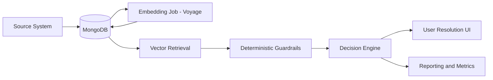

# 👩🏼‍⚕️👨🏻Member Match + Vector Retrieval (Atlas Vector Search)

This repo demonstrates a **safe, production-grade approach to member matching** using
vector similarity for candidate retrieval and deterministic rules for final decisions.

**Core idea**
- Vector search improves *recall* (find the right candidates)
- Rules and filters preserve *precision* (no improper merges)

---

## High-level architecture



---

## Why this design is safe

- Vector similarity **never performs merges**
- It only determines *which records to compare*
- Deterministic rules decide:
  - auto-match
  - human review
  - create new member
- Guardrails (tenant, group, DOB) prevent cross-entity collisions

---

## Tech stack

- **MongoDB Atlas** (Vector Search)
- **Voyage AI** – `voyage-4-large` (1024-dim embeddings)
- **Python** (PyMongo + batch embedding job)
- **mongosh** for querying and demos

---

## Data model (simplified)

Database: `membermatch`  
Collection: `patients`

Important fields:
- `incomingMemberMatchValue.identityText`
- `incomingMemberMatchValue.identityEmbedding`
- `incomingMemberMatchValue.memberGroupID`
- `incomingMemberMatchValue.birthDate`

---

## Setup

### 1. Create database and collection

```js
use membermatch
db.createCollection("patients")
```

### 2. Load demo documents

Insert sample documents using `insertMany()`.

---

## Create identityText

Canonical identity string used for embeddings.

```js
db.patients.updateMany(
  {},
  [
    {
      $set: {
        "incomingMemberMatchValue.identityText": {
          $toLower: {
            $concat: [
              "first:", "$incomingMemberMatchValue.firstName", " ",
              "last:", "$incomingMemberMatchValue.lastName", " ",
              "dob:", "$incomingMemberMatchValue.birthDate", " ",
              "gender:", "$incomingMemberMatchValue.gender", " ",
              "group:", "$incomingMemberMatchValue.memberGroupID"
            ]
          }
        }
      }
    }
  ]
)
```

---

## Generate embeddings (Voyage AI)

`embed.py`

```python
from pymongo import MongoClient
from voyageai import Client
from tqdm import tqdm

MONGODB_URI = "mongodb+srv://<user>:<pass>@<cluster>.mongodb.net/"
DB = "membermatch"
COLLECTION = "patients"

voyage = Client(api_key="VOYAGE_API_KEY")
mongo = MongoClient(MONGODB_URI)
col = mongo[DB][COLLECTION]

docs = list(col.find(
    {
        "incomingMemberMatchValue.identityText": {"$exists": True},
        "incomingMemberMatchValue.identityEmbedding": {"$exists": False}
    },
    {"incomingMemberMatchValue.identityText": 1}
))

for d in tqdm(docs):
    vec = voyage.embed(
        [d["incomingMemberMatchValue"]["identityText"]],
        model="voyage-4-large"
    ).embeddings[0]

    col.update_one(
        {"_id": d["_id"]},
        {"$set": {"incomingMemberMatchValue.identityEmbedding": vec}}
    )
```

---

## Create Vector Search index (Atlas UI)

Database: `membermatch`  
Collection: `patients`

```json
{
  "fields": [
    {
      "type": "vector",
      "path": "incomingMemberMatchValue.identityEmbedding",
      "numDimensions": 1024,
      "similarity": "cosine"
    }
  ]
}
```

Index name is often **default** unless overridden.

Verify:

```js
db.patients.getSearchIndexes()
```

---

## Vector retrieval query

```js
var q = db.patients.find(
  { "incomingMemberMatchValue.identityEmbedding": { $exists: true } },
  { "incomingMemberMatchValue.identityEmbedding": 1, _id: 0 }
).limit(1).toArray()[0].incomingMemberMatchValue.identityEmbedding

db.patients.aggregate([
  {
    $vectorSearch: {
      index: "default",
      path: "incomingMemberMatchValue.identityEmbedding",
      queryVector: q,
      numCandidates: 50,
      limit: 10
    }
  },
  {
    $project: {
      score: { $meta: "vectorSearchScore" },
      firstName: "$incomingMemberMatchValue.firstName",
      lastName: "$incomingMemberMatchValue.lastName",
      birthDate: "$incomingMemberMatchValue.birthDate",
      memberGroupID: "$incomingMemberMatchValue.memberGroupID"
    }
  }
]).toArray()
```

---

## Guardrails without changing the index

Apply deterministic filters *after* retrieval:

```js
db.patients.aggregate([
  {
    $vectorSearch: {
      index: "default",
      path: "incomingMemberMatchValue.identityEmbedding",
      queryVector: q,
      numCandidates: 50,
      limit: 20
    }
  },
  {
    $match: {
      "incomingMemberMatchValue.memberGroupID": "3332211",
      "incomingMemberMatchValue.birthDate": "1981-03-02"
    }
  }
]).toArray()
```

---

## Demo narrative

> We did not change the matching rules.  
> We improved who we compare against.  
> Vector search increases recall; rules maintain safety.

---

## License

MIT
