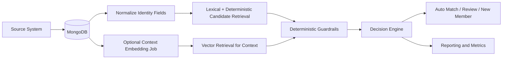

# 👩🏼‍⚕️👨🏻 Member Matching for Insurance with MongoDB Atlas Search

This repo demonstrates a safe, production-oriented approach to healthcare member matching using **deterministic matching**, **lexical search**, and optional **vector retrieval for contextual enrichment**.

## Core idea

Member identity fields are not semantic concepts. Names, dates of birth, member IDs, group IDs, phone numbers, and emails should be matched using deterministic and lexical techniques, not vector similarity alone.

- Deterministic rules preserve precision for identity fields.
- Atlas Search improves recall for names, typos, prefixes, and alternate spellings.
- Vector Search can enrich matching when comparing non-identity context such as notes, addresses, plan descriptions, or free-text summaries.
- Vector similarity never performs merges.
- Final decisions are made by deterministic rules, confidence scoring, and human review when needed.

---

## Why not vectorize member names?

A name is an identifier. Small changes matter.

For example:

```text
Donnie Johnson
Don Johnson
Donald Johnson
Donny Johnston
```

A vector model may consider these similar, but similarity is not the same as identity. In member matching, this can create unsafe candidate sets or confusing rankings if vector similarity is the primary retrieval mechanism.

Use vectors for “what this record is about,” not as the source of truth for “who this person is.”

---

## High-level architecture


```mermaid
flowchart LR
    A[Source System] --> B[(MongoDB)]
    B --> C[Normalize Identity Fields]
    C --> D[Lexical + Deterministic Candidate Retrieval]
    B --> E[Optional Context Embedding Job]
    E --> F[Vector Retrieval for Context]
    D --> G[Deterministic Guardrails]
    F --> G
    G --> H[Decision Engine]
    H --> I[Auto Match / Review / New Member]
    H --> J[Reporting and Metrics]
```

---

## Design principles

- Do not use vector similarity as the primary match signal for member identity.
- Use exact and normalized matching for hard identifiers.
- Use Atlas Search for name recall: autocomplete, fuzzy search, and token matching.
- Use deterministic guardrails for tenant, group, date of birth, and other required boundaries.
- Use vector search only for contextual fields where semantic similarity is meaningful.
- Never auto-merge from vector similarity alone.
- Send ambiguous matches to human review.

---

## Tech stack

- **MongoDB Atlas**
- **Atlas Search** for lexical, autocomplete, and fuzzy name matching
- **Atlas Vector Search** for optional context enrichment
- **Python / Node.js / mongosh** for demos and data preparation

---

## Data model

Database: `membermatch`  
Collection: `patients`

Example document shape:

```json
{
  "incomingMemberMatchValue": {
    "memberId": "M123456",
    "firstName": "Donnie",
    "lastName": "Johnson",
    "fullName": "Donnie Johnson",
    "normalizedFirstName": "donnie",
    "normalizedLastName": "johnson",
    "normalizedFullName": "donnie johnson",
    "birthDate": "1981-03-02",
    "gender": "M",
    "memberGroupID": "3332211",
    "phone": "555-123-4567",
    "email": "donnie.johnson@example.com",

    "contextText": "Optional free-text notes, care context, address history, or plan description.",
    "contextEmbedding": [0.0123, -0.0456]
  }
}
```

### Identity fields

Use deterministic or lexical matching:

- `memberId`
- `firstName`
- `lastName`
- `fullName`
- `normalizedFirstName`
- `normalizedLastName`
- `normalizedFullName`
- `birthDate`
- `gender`
- `memberGroupID`
- `phone`
- `email`

### Context fields

Use vector search only when the field contains meaningful descriptive text:

- `contextText`
- `careProgramDescription`
- `addressHistorySummary`
- `clinicalNotesSummary`
- `memberProfileSummary`

---

## Setup

### 1. Create database and collection

```js
use membermatch
db.createCollection("patients")
```

---

## Normalize identity fields

Create normalized fields for deterministic and lexical matching.

```js
db.patients.updateMany(
  {},
  [
    {
      $set: {
        "incomingMemberMatchValue.fullName": {
          $concat: [
            "$incomingMemberMatchValue.firstName",
            " ",
            "$incomingMemberMatchValue.lastName"
          ]
        },
        "incomingMemberMatchValue.normalizedFirstName": {
          $toLower: "$incomingMemberMatchValue.firstName"
        },
        "incomingMemberMatchValue.normalizedLastName": {
          $toLower: "$incomingMemberMatchValue.lastName"
        },
        "incomingMemberMatchValue.normalizedFullName": {
          $toLower: {
            $concat: [
              "$incomingMemberMatchValue.firstName",
              " ",
              "$incomingMemberMatchValue.lastName"
            ]
          }
        }
      }
    }
  ]
)
```

In a production pipeline, normalization should also handle:

- trimming whitespace
- punctuation removal
- casing
- hyphenated names
- middle initials
- suffixes such as Jr, Sr, III
- nicknames and aliases
- phone and email canonicalization

---

## Recommended indexes

### Exact indexes for deterministic fields

```js
db.patients.createIndex({
  "incomingMemberMatchValue.memberId": 1
})

db.patients.createIndex({
  "incomingMemberMatchValue.memberGroupID": 1,
  "incomingMemberMatchValue.birthDate": 1
})

db.patients.createIndex({
  "incomingMemberMatchValue.normalizedFullName": 1
})

db.patients.createIndex({
  "incomingMemberMatchValue.email": 1
})

db.patients.createIndex({
  "incomingMemberMatchValue.phone": 1
})
```

---

## Atlas Search index for name matching

Use Atlas Search for text, fuzzy, and autocomplete matching on names.

Example Atlas Search index definition:

```json
{
  "mappings": {
    "dynamic": false,
    "fields": {
      "incomingMemberMatchValue": {
        "type": "document",
        "fields": {
          "firstName": [
            { "type": "string" },
            { "type": "autocomplete" }
          ],
          "lastName": [
            { "type": "string" },
            { "type": "autocomplete" }
          ],
          "fullName": [
            { "type": "string" },
            { "type": "autocomplete" }
          ],
          "normalizedFullName": {
            "type": "string"
          },
          "birthDate": {
            "type": "string"
          },
          "memberGroupID": {
            "type": "string"
          }
        }
      }
    }
  }
}
```

---

## Candidate retrieval query

For identity matching, start with deterministic filters and lexical search.

```js
const query = "Donnie Johnson"

db.patients.aggregate([
  {
    $search: {
      index: "member_name_search",
      compound: {
        must: [
          {
            text: {
              path: "incomingMemberMatchValue.memberGroupID",
              query: "3332211"
            }
          }
        ],
        should: [
          {
            text: {
              path: "incomingMemberMatchValue.normalizedFullName",
              query: query.toLowerCase(),
              score: { boost: { value: 20 } }
            }
          },
          {
            text: {
              path: [
                "incomingMemberMatchValue.firstName",
                "incomingMemberMatchValue.lastName",
                "incomingMemberMatchValue.fullName"
              ],
              query: query,
              score: { boost: { value: 10 } }
            }
          },
          {
            autocomplete: {
              path: "incomingMemberMatchValue.fullName",
              query: query,
              score: { boost: { value: 6 } }
            }
          },
          {
            text: {
              path: "incomingMemberMatchValue.fullName",
              query: query,
              fuzzy: {
                maxEdits: 1,
                prefixLength: 2
              },
              score: { boost: { value: 3 } }
            }
          }
        ],
        minimumShouldMatch: 1
      }
    }
  },
  {
    $match: {
      "incomingMemberMatchValue.birthDate": "1981-03-02"
    }
  },
  {
    $project: {
      searchScore: { $meta: "searchScore" },
      firstName: "$incomingMemberMatchValue.firstName",
      lastName: "$incomingMemberMatchValue.lastName",
      birthDate: "$incomingMemberMatchValue.birthDate",
      memberGroupID: "$incomingMemberMatchValue.memberGroupID"
    }
  },
  { $limit: 10 }
]).toArray()
```

---

## Deterministic guardrails

Guardrails are required before any match decision.

Examples:

```js
{
  "incomingMemberMatchValue.memberGroupID": "3332211",
  "incomingMemberMatchValue.birthDate": "1981-03-02"
}
```

Common guardrails:

- same tenant
- same payer or plan boundary
- same member group
- same date of birth
- compatible name evidence
- compatible phone, email, or address evidence
- no conflicting hard identifiers

---

## Decision engine

Candidate retrieval is not the same as matching.

A simple decision model:

```text
Auto-match:
  - exact member ID, or
  - strong name match + same DOB + same group + supporting secondary identifier

Human review:
  - similar name + same DOB + missing secondary identifier
  - nickname/alias match + partial supporting evidence
  - conflicting or incomplete identity evidence

Create new member:
  - no candidate clears deterministic thresholds
  - hard identifiers conflict
```

Example scoring categories:

```text
Hard identifiers:
  member ID, subscriber ID, government/member system ID

Strong identity evidence:
  normalized full name, DOB, member group

Supporting evidence:
  phone, email, address, gender, plan relationship

Contextual evidence:
  notes, care program, plan description, household context
```

---

## Optional vector retrieval for context

Vector search can be useful when you have descriptive non-identity text.

Good examples:

```text
care management notes
member profile summaries
address history summaries
household context
plan description text
support ticket summaries
```

Poor examples:

```text
first name
last name
date of birth
member ID
group ID
email
phone
```

---

## Create context text

Only create context text from fields where semantic meaning is useful.

```js
db.patients.updateMany(
  {},
  [
    {
      $set: {
        "incomingMemberMatchValue.contextText": {
          $toLower: {
            $concat: [
              "address summary: ",
              { $ifNull: ["$incomingMemberMatchValue.addressSummary", ""] },
              " care notes: ",
              { $ifNull: ["$incomingMemberMatchValue.careNotesSummary", ""] },
              " plan description: ",
              { $ifNull: ["$incomingMemberMatchValue.planDescription", ""] }
            ]
          }
        }
      }
    }
  ]
)
```

---

## Generate context embeddings

Example `embed_context.py`:

```python
from pymongo import MongoClient
from voyageai import Client
from tqdm import tqdm
import os

MONGODB_URI = os.environ["MONGODB_URI"]
VOYAGE_API_KEY = os.environ["VOYAGE_API_KEY"]

DB = "membermatch"
COLLECTION = "patients"

voyage = Client(api_key=VOYAGE_API_KEY)
mongo = MongoClient(MONGODB_URI)
col = mongo[DB][COLLECTION]

docs = list(col.find(
    {
        "incomingMemberMatchValue.contextText": {"$exists": True, "$ne": ""},
        "incomingMemberMatchValue.contextEmbedding": {"$exists": False}
    },
    {"incomingMemberMatchValue.contextText": 1}
))

for d in tqdm(docs):
    vec = voyage.embed(
        [d["incomingMemberMatchValue"]["contextText"]],
        model="voyage-4-large"
    ).embeddings[0]

    col.update_one(
        {"_id": d["_id"]},
        {"$set": {"incomingMemberMatchValue.contextEmbedding": vec}}
    )
```

---

## Atlas Vector Search index for context

Create this only if you are using contextual vector retrieval.

```json
{
  "fields": [
    {
      "type": "vector",
      "path": "incomingMemberMatchValue.contextEmbedding",
      "numDimensions": 1024,
      "similarity": "cosine"
    },
    {
      "type": "filter",
      "path": "incomingMemberMatchValue.memberGroupID"
    },
    {
      "type": "filter",
      "path": "incomingMemberMatchValue.birthDate"
    }
  ]
}
```

---

## Contextual vector retrieval query

Use vector retrieval as a supporting signal, not as the source of truth.

```js
db.patients.aggregate([
  {
    $vectorSearch: {
      index: "member_context_vector",
      path: "incomingMemberMatchValue.contextEmbedding",
      queryVector: q,
      numCandidates: 100,
      limit: 20,
      filter: {
        "incomingMemberMatchValue.memberGroupID": "3332211",
        "incomingMemberMatchValue.birthDate": "1981-03-02"
      }
    }
  },
  {
    $project: {
      vectorScore: { $meta: "vectorSearchScore" },
      firstName: "$incomingMemberMatchValue.firstName",
      lastName: "$incomingMemberMatchValue.lastName",
      birthDate: "$incomingMemberMatchValue.birthDate",
      memberGroupID: "$incomingMemberMatchValue.memberGroupID",
      contextText: "$incomingMemberMatchValue.contextText"
    }
  }
]).toArray()
```

---

## Recommended ranking order

Use a ranking model where identity evidence dominates contextual similarity.

```text
1. Exact member ID
2. Exact email / phone / subscriber ID
3. Same member group + same DOB
4. Exact normalized full name
5. First + last token match
6. Autocomplete / prefix name match
7. Fuzzy name match
8. Supporting demographic evidence
9. Contextual vector similarity
```

Vector similarity should not outrank hard identity evidence.

---

## Demo narrative

Use this message when explaining the demo:

> We use deterministic and lexical matching for identity fields because healthcare member identity requires precision.  
> Atlas Search improves name recall for typos, prefixes, and alternate spellings.  
> Atlas Vector Search is optional and is used only for contextual enrichment, not as the primary identity match mechanism.  
> Final match decisions are made by rules, guardrails, and human review when ambiguity remains.

---

## What changed from a vector-first design?

Previous vector-first pattern:

```text
identityText = first name + last name + DOB + gender + group
identityEmbedding = embedding(identityText)
vector search retrieves candidates
rules filter afterward
```

Corrected pattern:

```text
identity fields = deterministic + lexical matching
context text = optional vector retrieval
rules and guardrails decide final outcome
```

This avoids treating identity fields as semantic text and keeps member matching safer, more explainable, and easier to tune.

---

## License

MIT
